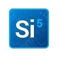
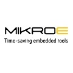
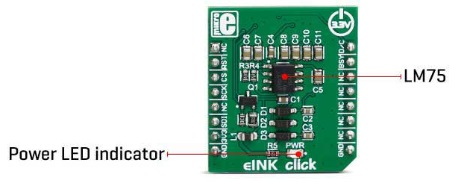
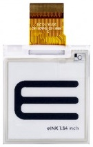
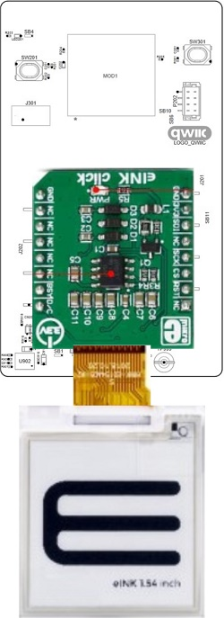
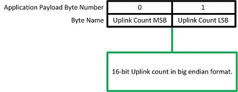

# RM126x Template Applications - RM126x Class A Display data

This template application demonstrates LoRaWAN Class A functionality for the [RM1261][RM126x module datasheet] and [RM1262][RM126x module datasheet]. The count of uplinks is displayed on a [1.54 inch ePaper display] controlled by a [MikroE EInk Click board].

The RM1261 incorporates a [Semtech SX1261][Semtech SX1261 product page] LoRa radio and is intended for use in countries with a transmit power limitation of up to 15dBm (EU, India, Japan, Taiwan & UK).

The RM1262 incorporates a [Semtech SX1262][Semtech SX1262 product page] LoRa radio and is intended for use in countries with a transmit power limitation of up to 22dBm (Australia, New Zealand & US).

# Setup

The [RM126x DVK][RM126x DVK user guide] must be configured for SPI operation prior to fitting the Click board.

The EInk Click board is shown below.

The E-Paper display is shown below.

Care should be taken to ensure the designations on the Click connector align with those of the RM126x DVK, and the display is inserted with the correct orientation into the EInk Click board.

The E-Paper display and Click board fitted in the correct orientations are shown below.

# Configuration

Details of the associated configuration options are described in the [RM126x GSDK Extension user guide][RM126x GSDK Extension user guide].

The template application was tested with an [RM1261 DVK][RM126x DVK user guide] and [RM1262 DVK][RM126x DVK user guide].

# Operation

During start-up, the EInk board is initialised then peripherals associated with the Semtech radio started and the LoRaWAN stack initialised. As part of initialisation, the Ezurio logo and details of the RM126x module in use are shown on the display. (Bitmaps were created using [Gimp] by converting to .xbm format).

The application then attempts to initiate a Class A connection with the Network Server, and will perform repeated attempts to establish the connection.

Upon successful connection, the application will send periodic uplinks containing a 2-byte uplink count. The uplink count is reflected on the display.

The uplink data is formatted as shown below.

Downlink messages can be received in the RX1 or RX2 receive windows opened following each uplink.

[RM126x module datasheet]: <https://www.ezurio.com/documentation/datasheet-rm126x-lorawan-module>
[RM126x DVK user guide]: <https://www.ezurio.com/documentation/user-guide-rm126x-development-kit>
[RM126x GSDK Extension user guide]: <https://www.ezurio.com/documentation/application-note-c-code-development-rm126x-series>
[Semtech SX1261 product page]: <https://www.semtech.com/products/wireless-rf/lora-connect/sx1261>
[Semtech SX1262 product page]: <https://www.semtech.com/products/wireless-rf/lora-connect/sx1262>
[MikroE Environment 2 Click board product page]: <https://www.mikroe.com/environment-2-click>
[1.54 inch ePaper display]: <https://www.mikroe.com/e-paper-display-154-200x200-dots>
[MikroE EInk Click board]: <https://www.mikroe.com/eink-click-without-display>
[Gimp]: <https://www.gimp.org/>
