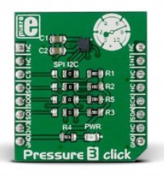
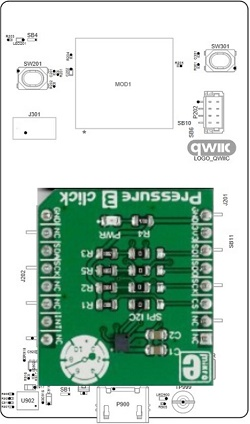
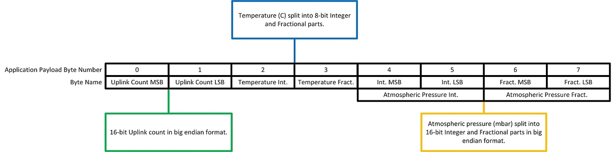

# RM126x Template Applications - RM126x Class A Weather data

This template application demonstrates LoRaWAN Class A functionality for the [RM1261][RM126x module datasheet] and [RM1262][RM126x module datasheet]. Temperature and atmospheric pressure data, read from a [MikroE Pressure 3 Click board][MikroE Pressure 3 Click board product page], is included in each uplink.

The RM1261 incorporates a [Semtech SX1261][Semtech SX1261 product page] LoRa radio and is intended for use in countries with a transmit power limitation of up to 15dBm (EU, India, Japan, Taiwan & UK).

The RM1262 incorporates a [Semtech SX1262][Semtech SX1262 product page] LoRa radio and is intended for use in countries with a transmit power limitation of up to 22dBm (Australia, New Zealand & US).

# Setup

The [RM126x DVK][RM126x DVK user guide] must be [configured for SPI operation][RM126x DVK SPI configuration] prior to fitting the Click board.

The Pressure 3 Click board must be configured for [SPI operation][MikroE Pressure 3 Click board product page] prior to mounting on the RM126x DVK. Default configuration is for I2C operation via the four resistors in the I2C column shown below.

The four resistors must be moved to the SPI column to enable SPI operation.

Care should be taken to ensure the designations on the Click connector align with those of the RM126x DVK.

The Click board fitted in the correct orientation is shown below.

# Configuration

Details of the associated configuration options are described in the [RM126x GSDK Extension user guide][RM126x GSDK Extension user guide].

The template application was tested with an [RM1261 DVK][RM126x DVK user guide] and [RM1262 DVK][RM126x DVK user guide].

# Operation

During start-up, the Pressure 3 board is initialised then peripherals associated with the Semtech radio started and the LoRaWAN stack initialised.

The application then attempts to initiate a Class A connection with the Network Server, and will perform repeated attempts to establish the connection.

Upon successful connection, the application will send periodic uplinks containing a 2-byte uplink count and the latest temperature and atmospheric pressure readings from the Pressure 3 board.

The uplink data is formatted as shown below.

Temperature data is encoded into [8-bit integer and fractional parts][RM126x Split 8-bit formatting].

Atmospheric pressure data is encoded into [16-bit integer and fractional parts][RM126x Split 16-bit formatting].

Downlink messages can be received in the RX1 or RX2 receive windows opened following each uplink.

[RM126x module datasheet]: <https://www.ezurio.com/documentation/datasheet-rm126x-lorawan-module>
[RM126x DVK user guide]: <https://www.ezurio.com/documentation/user-guide-rm126x-development-kit>
[RM126x GSDK Extension user guide]: <https://www.ezurio.com/documentation/application-note-c-code-development-rm126x-series>
[Semtech SX1261 product page]: <https://www.semtech.com/products/wireless-rf/lora-connect/sx1261>
[Semtech SX1262 product page]: <https://www.semtech.com/products/wireless-rf/lora-connect/sx1262>
[MikroE Pressure 3 Click board product page]: <https://www.mikroe.com/pressure-3-click>
[RM126x DVK SPI configuration]: <rm126x_spi_configuration.md>
[RM126x Split 8-bit formatting]: <rm126x_split_8_bit_formatter.md>
[RM126x Split 16-bit formatting]: <rm126x_split_16_bit_formatter.md>
