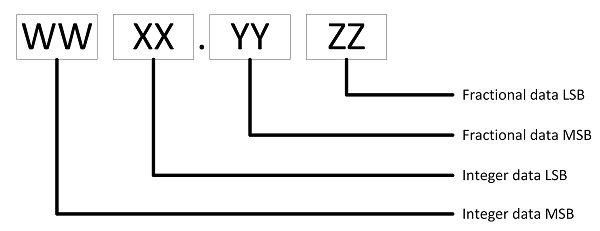

# RM126x Template Applications - Split 16-Bit Payload Formatting

Floating point data within the range of a signed 16-bit number (-32768 .. 32767) is converted into four signed 8-bit bytes to simplify decoding by cloud based hosts. Two bytes represent the integer part of the data, and the other two bytes the fractional part of the data.

Data in this format is decoded as follows.

# Decoding split 16-bit payload data

Split 16-bit data appears as shown below in application payload data.

$Decoded Value = ((WW * 256) + XX) + (((YY * 256) + ZZ)/100)$

A temperature of 248.81C consists of integer parts 248 (0xF8) and fractional 81 (0x51). Encoded byte values would be 0x0, 0xF8, 0x0 and 0x51.

These values would decode as follows.

$((0x0 * 256) + 0xF8) + (((0x0 * 256) + 0x51)/100) = 248.81$

A temperature of -1021.78 consists of integer parts -1021 (0xFC03) and fractional -78 (0xFFB2). Encoded byte values would be 0xFC, 0x03, 0xFF and 0xB2.

These values would decode as follows.

$((0xFC * 256) + 0x03) + (((0xFF * 256) + 0xB2)/100) = -1021.78$
