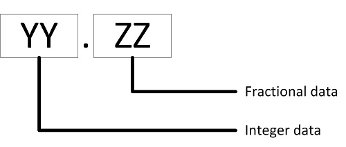

# RM126x Template Applications - Split 8-Bit Payload Formatting

Floating point data within the range of a signed 8-bit number (-128 .. 127) is converted into two signed 8-bit bytes to conserve space when transmitting over LoRa and to simplify decoding by cloud based hosts. One byte represents the integer part of the data and the other the fractional part.

Data in this format is decoded as follows.

# Decoding split 8-bit payload data

Split 8-bit data appears as shown below in application payload data.

$Decoded Value = YY + (ZZ / 100)$

A temperature of 24.5C would be encoded as 24 and 50 and decoded as follows.

$24 + (50 / 100) = 24.5$

A negative temperature of -75.71 would be encoded as -75 and -71 and decoded as follows.

$-75 + (-71 / 100) = -75.71$
